<!-- <h1 align="center">
    
    
</h1>

  <i align="center">Push Protocol is a web3 communication network, enabling cross-chain notifications, messaging, video, and NFT chat for dapps, wallets, and services.🚀</i>

<h4 align="center">

  
  
  
</h4> -->

# Build with Wallet Tracker

## About the Program

<strong>Built with Wallet Tracker</strong> is an open-source inititative to bring in talented developers from all across the world to build, innovate and add features to the currently existing Wallet Tracker channel and chatbot. By participating in this campaign, you'll have the opportunity to showcase your creativity and technical skills!

## What is Wallet Tracker?

Wallet Tracker currently exists as two projects:  

- [Wallet Tracker Channel](https://app.push.org/channels/0x0f0aE1ceEBc4b5aB14A47202eD6A52D3ef698b5B){:target="_blank"}
- [Wallet Tracker Chat](https://app.push.org/chat/0x171ee5794a4e81F0acCfAbf0CA9554b738be7968){:target="_blank"}

### Wallet Tracker Channel

The channel serves as your comprehensive portfolio tracker, offering a variety of features designed to keep you informed and up-to-date. Key features include:

- **Wallet Transactions Update:** Stay informed with real-time updates on your wallet transactions.

  

  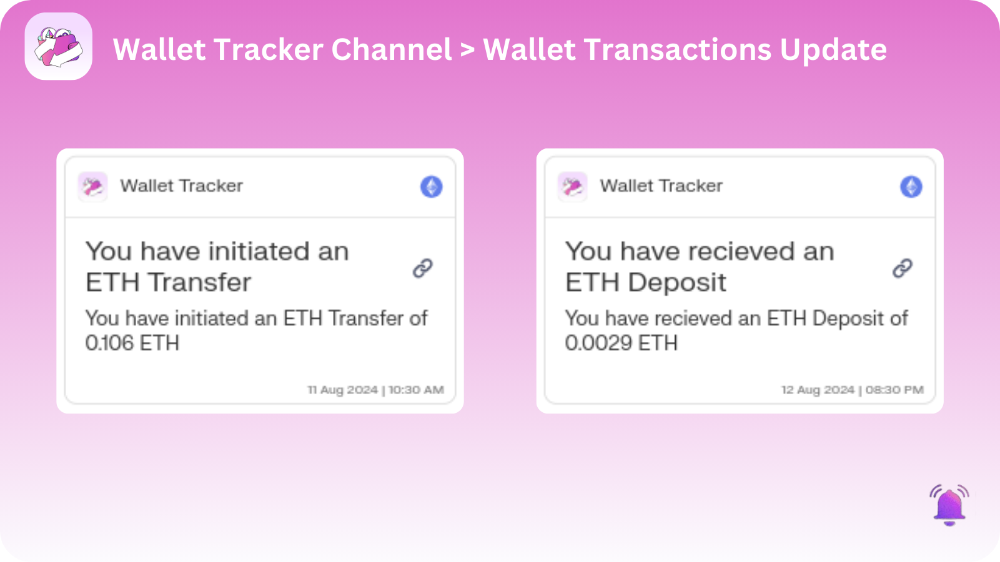
  

- **Biweekly Performance Update:** Receive regular updates on your portfolio's performance every two weeks.

  

  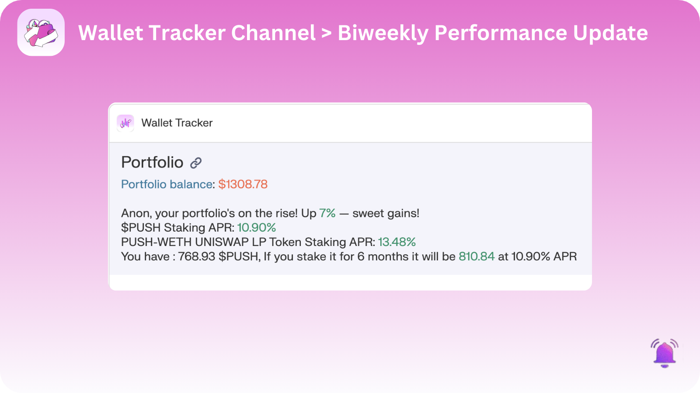
  

- **Crypto Calendar for Web3 Events:** Keep track of important web3 events with our dedicated crypto calendar.

  

  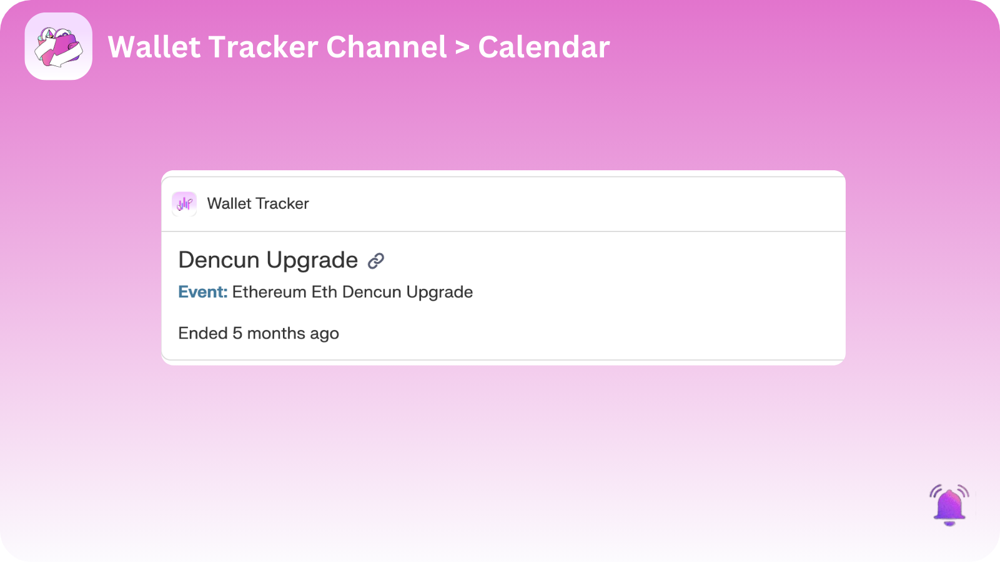
  

- **Push and Uniswap V2 LP Staking APR Rates:** Access the latest APR rates for Push and Uniswap V2 LP staking.

  

  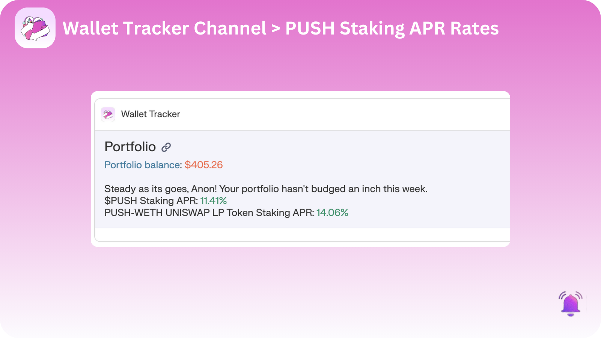
  

  - **Active Token Approvals:**  Stay informed about your active token approvals to maintain control over your asset security.

  

  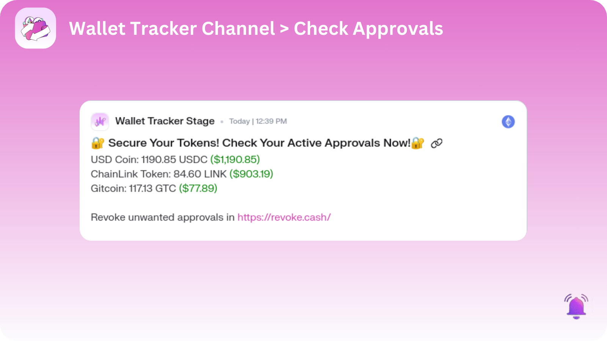
  

  - **DAO Proposals:** Stay updated on proposals related to your held tokens to engage in governance effectively.

  

  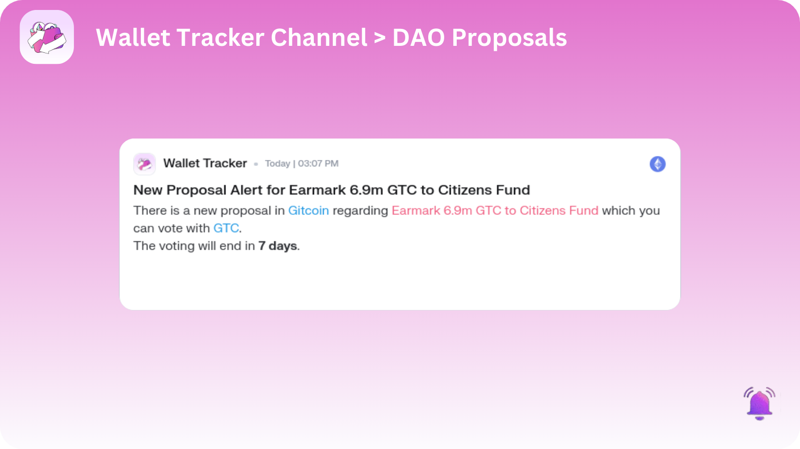
  

  - **Recent Crypto Hacks:** Stay informed about recent crypto hacks to protect your assets and take necessary precautions.

  

  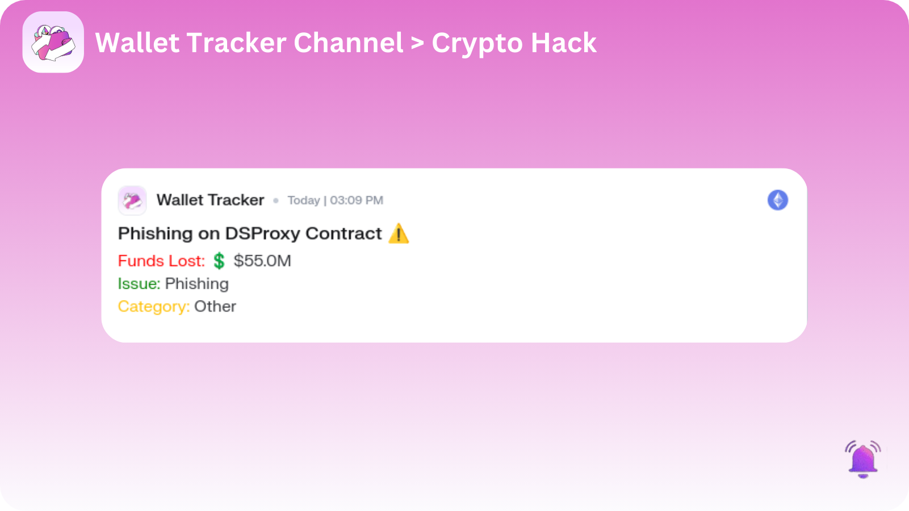
  

  - **Yield Opportunities:** Stay informed about yield opportunities for tokens you hold to maximize your earnings and optimize your investments.

  

  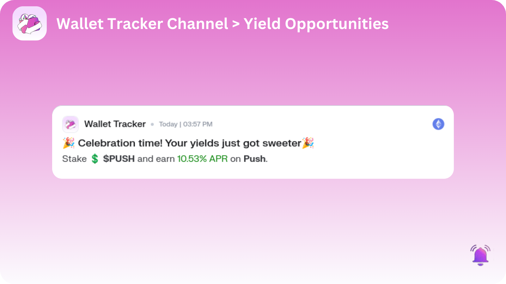
  

You can explore the channel [here](https://app.push.org/channels/0x0f0aE1ceEBc4b5aB14A47202eD6A52D3ef698b5B) to view the most recent notifications. Opt-in to the channel with your primary wallet to start receiving notifications for these events immediately.

### Wallet Tracker Chat

The chatbot integrates all the functionalities of the channel into an interactive experience. The features include:

- **Check User's Wallet Worth and Token Holdings:** Easily check the worth of your wallet and your token holdings.  
  `/portfolio [wallet address] [chain]` : To get your current token holding and asset valuation on the specified chain. Chain options: "eth", "pol", "bsc", "arb", "polzk". If not specified, you'll get the portfolio across all 5 chains.

  

  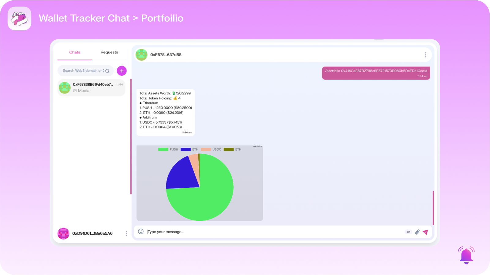
  

- **Check Out Crypto Events:** Stay updated with upcoming crypto events.  
  `/calendar [number of days]` : To get crypto events organized by your favorite tokens within the specified number of days.

  

  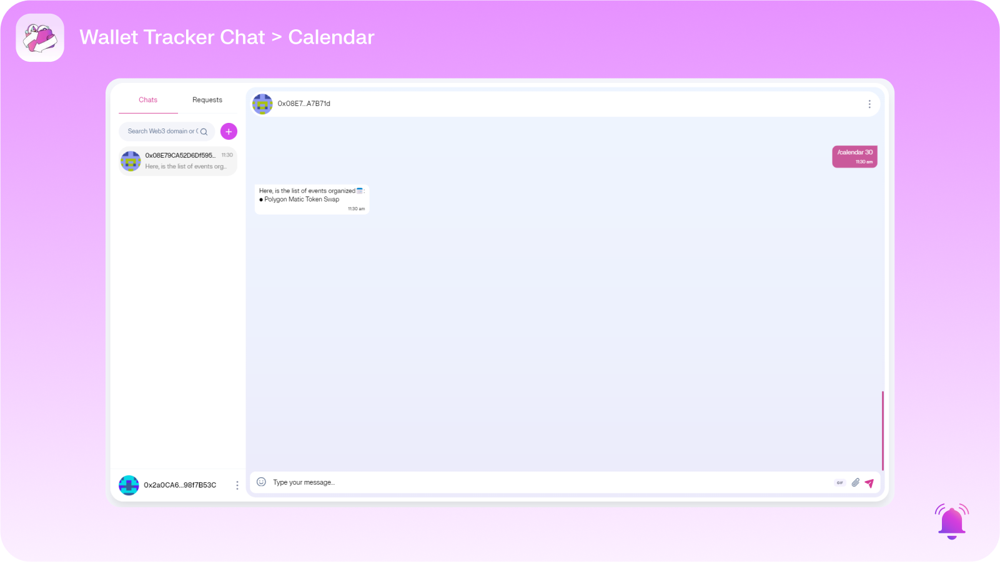
  

- **Wallet Performance:** Monitor the performance of your wallet.  
  `/performance [your wallet address] [no of days] [chain]` : To get your wallet performance across the given days.

  

  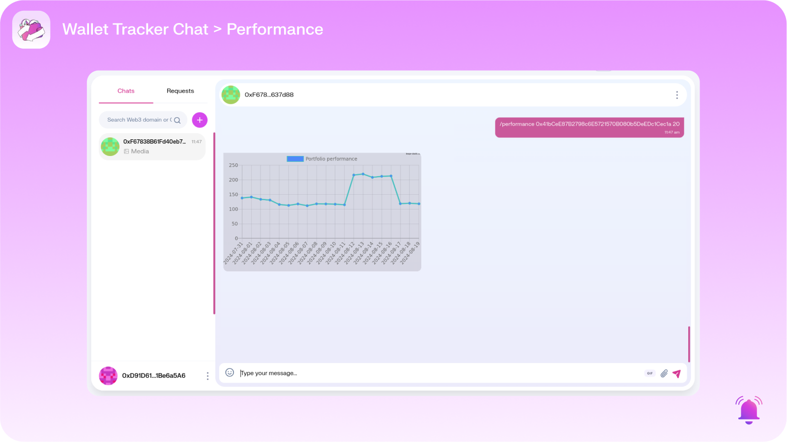
  

- **NFTs Portfolio:** View your NFTs portfolio.
  `/topnfts [your wallet address] [chain]` : Get the top recent NFTs in your wallet.

  

  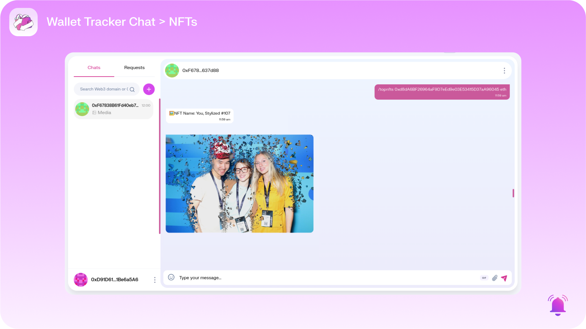
  

  - **Token Approvals:** View your NFTs portfolio.
  `/topnfts [your wallet address] [chain]` : Get the top recent NFTs in your wallet.

  

  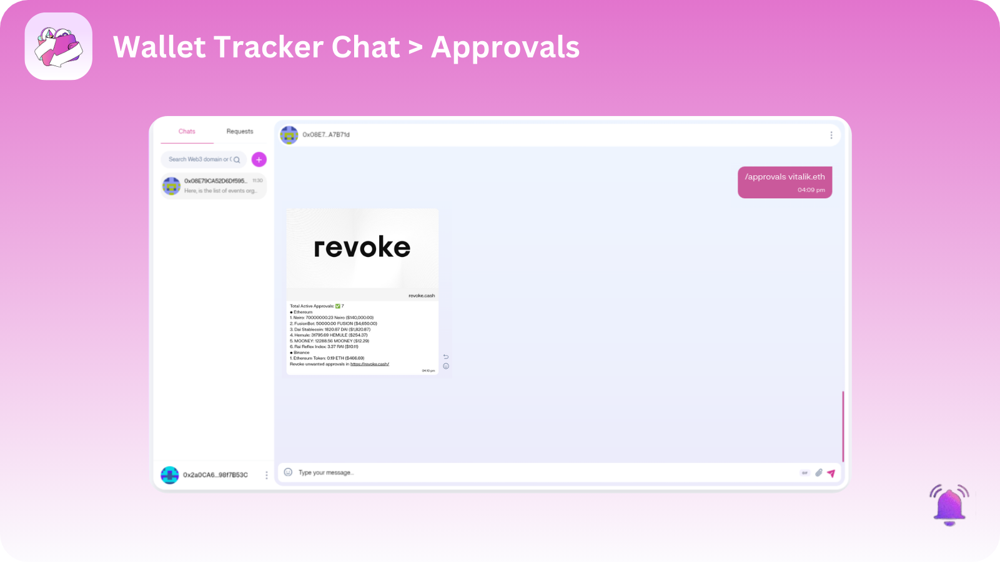
  

  - **Top Yields:** Yield Opportunities for tokens you Hold.
  `/topyields [your wallet address] [chain]` : Get the Yield Opportunities for tokens you Hold.

  

  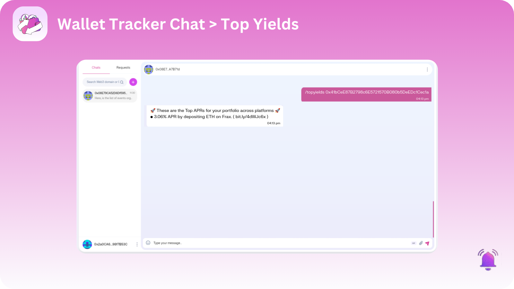
  

- **ENS and Unstoppable Domain Support:** Get support for Ethereum Name Service (ENS) and Unstoppable Domains.

- **Multi-Chain Support for Wallet:** Enjoy support for multiple blockchain networks.

We are constantly working on it and adding new features. Type `/help` to get the latest available commands and responses.

  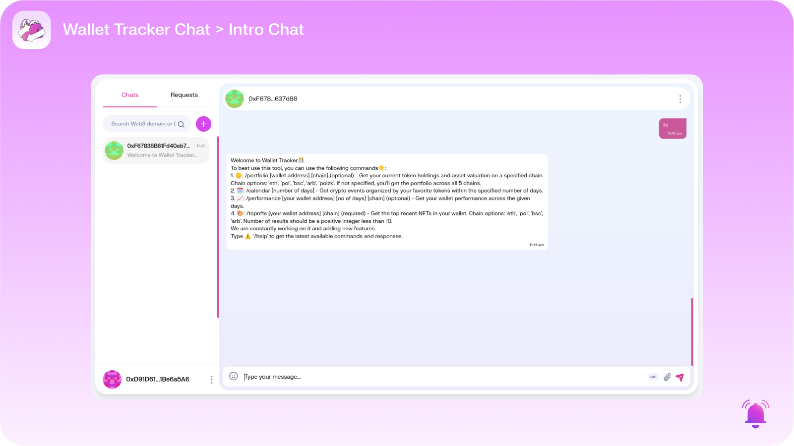
  

You can explore the chatbot [here](https://app.push.org/chat/0x171ee5794a4e81F0acCfAbf0CA9554b738be7968) and start interacting with it!

## Setting-up the project locally

- [Guide for setting up Wallet Tracker channel](./push-showrunners-framework/README.md)
- [Guide for setting up Wallet Tracker chatbot](./wallet-tracker-chat/README.md)

## Contributing

Build with Wallet Tracker is an open source project. We firmly believe in a completely transparent development process and value any contributions. We would love to have you as a member of the community, whether you are assisting us in bug fixes, suggesting new features, enhancing our documentation, or simply spreading the word.

- Bug Report: Please create a bug report if you encounter any errors or problems while utilising the Push Protocol.
- Feature Request: Please submit a feature request if you have an idea or discover a capability that would make development simpler and more reliable.
- Documentation Request: If you're reading the Push documentation and believe that we're missing something, please create a docs request.

  Not sure where to start? Join our discord and we will help you get started!

  

## Resources

- **[Push Website](https://push.org):** Explore our product and learn more about what we offer.
- **[Push Docs](https://docs.push.org/developers/):** Dive into our comprehensive documentation for all the details you need.
- **[Push Dapp](https://app.push.org):** Check out every feature in action on our Dapp!
- **[Discord](https://discord.com/invite/pushprotocol):** Join our community for support and discussions with the team and fellow developers.
- **[GitHub](https://github.com/push-protocol):** Check out our source code, project board, issues, and pull requests.
- **[Twitter](https://twitter.com/pushprotocol):** Follow us for the latest updates and blog posts.
